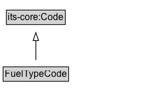

# FuelTypeCode

A code that indicates the type of fuel that is used by a vehicle.

EXAMPLE: gasoline, diesel, electric, etc.

## Diagram

=== "SVG (interactive)"

    <!-- Generated by graphviz version 14.1.3 (20260303.0454)
     -->
    <!-- Pages: 1 -->
    <svg width="180pt" height="132pt"
     viewBox="0.00 0.00 180.00 132.00" xmlns="http://www.w3.org/2000/svg" xmlns:xlink="http://www.w3.org/1999/xlink">
    <g id="graph0" class="graph" transform="scale(1 1) rotate(0) translate(4 128)">
    <polygon fill="white" stroke="none" points="-4,4 -4,-128 175.75,-128 175.75,4 -4,4"/>
    <g id="clust3" class="cluster">
    <title>cluster_associated</title>
    </g>
    <!-- its&#45;core_Code -->
    <g id="node1" class="node">
    <title>its&#45;core_Code</title>
    <g id="a_node1"><a xlink:href="https://w3id.org/itsdata/core/v1/Code" xlink:title="&lt;TABLE&gt;">
    <polygon fill="lightgray" stroke="none" points="5.12,-97.88 5.12,-114.12 78.38,-114.12 78.38,-97.88 5.12,-97.88"/>
    <text xml:space="preserve" text-anchor="start" x="6.12" y="-101.88" font-family="Arial" font-size="12.00">its&#45;core:Code</text>
    <polygon fill="none" stroke="black" points="4.12,-96.88 4.12,-115.12 79.38,-115.12 79.38,-96.88 4.12,-96.88"/>
    </a>
    </g>
    </g>
    <!-- FuelTypeCode -->
    <g id="node2" class="node">
    <title>FuelTypeCode</title>
    <g id="a_node2"><a xlink:href="../FuelTypeCode" xlink:title="&lt;TABLE&gt;">
    <polygon fill="lightgray" stroke="none" points="1,-25.88 1,-42.12 82.5,-42.12 82.5,-25.88 1,-25.88"/>
    <text xml:space="preserve" text-anchor="start" x="2" y="-29.88" font-family="Arial" font-size="12.00">FuelTypeCode</text>
    <polygon fill="none" stroke="black" points="0,-24.88 0,-43.12 83.5,-43.12 83.5,-24.88 0,-24.88"/>
    </a>
    </g>
    </g>
    <!-- FuelTypeCode&#45;&gt;its&#45;core_Code -->
    <g id="edge1" class="edge">
    <title>FuelTypeCode&#45;&gt;its&#45;core_Code</title>
    <path fill="none" stroke="black" d="M41.75,-51.79C41.75,-59.25 41.75,-68.24 41.75,-76.69"/>
    <polygon fill="none" stroke="black" points="38.25,-76.54 41.75,-86.54 45.25,-76.54 38.25,-76.54"/>
    </g>
    <!-- Invis -->
    </g>
    </svg>

=== "PNG"

    

## Formalization for FuelTypeCode

| Property | Constraint |
|----------|------------|
| subClassOf | [its-core:Code](its-core:Code.md) |

## Other annotations

| Property | Value |
|----------|-------|
| [rdfs:seeAlso](https://w3id.org/citydata/imported/rdfs/seeAlso) | DATEX-II FuelTypeEnum |

