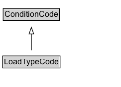

# LoadTypeCode

A code that indicates categories of load types that can affect the applicability of a regulation.

EXAMPLE: normal, wide load, over-height load, etc.

## Diagram

=== "SVG (interactive)"

    <!-- Generated by graphviz version 14.1.3 (20260303.0454)
     -->
    <!-- Pages: 1 -->
    <svg width="182pt" height="132pt"
     viewBox="0.00 0.00 182.00 132.00" xmlns="http://www.w3.org/2000/svg" xmlns:xlink="http://www.w3.org/1999/xlink">
    <g id="graph0" class="graph" transform="scale(1 1) rotate(0) translate(4 128)">
    <polygon fill="white" stroke="none" points="-4,4 -4,-128 178.25,-128 178.25,4 -4,4"/>
    <g id="clust3" class="cluster">
    <title>cluster_associated</title>
    </g>
    <!-- ConditionCode -->
    <g id="node1" class="node">
    <title>ConditionCode</title>
    <g id="a_node1"><a xlink:href="../ConditionCode" xlink:title="&lt;TABLE&gt;">
    <polygon fill="lightgray" stroke="none" points="1.75,-97.88 1.75,-114.12 84.75,-114.12 84.75,-97.88 1.75,-97.88"/>
    <text xml:space="preserve" text-anchor="start" x="2.75" y="-101.88" font-family="Arial" font-size="12.00">ConditionCode</text>
    <polygon fill="none" stroke="black" points="0.75,-96.88 0.75,-115.12 85.75,-115.12 85.75,-96.88 0.75,-96.88"/>
    </a>
    </g>
    </g>
    <!-- LoadTypeCode -->
    <g id="node2" class="node">
    <title>LoadTypeCode</title>
    <g id="a_node2"><a xlink:href="../LoadTypeCode" xlink:title="&lt;TABLE&gt;">
    <polygon fill="lightgray" stroke="none" points="1,-25.88 1,-42.12 85.5,-42.12 85.5,-25.88 1,-25.88"/>
    <text xml:space="preserve" text-anchor="start" x="2" y="-29.88" font-family="Arial" font-size="12.00">LoadTypeCode</text>
    <polygon fill="none" stroke="black" points="0,-24.88 0,-43.12 86.5,-43.12 86.5,-24.88 0,-24.88"/>
    </a>
    </g>
    </g>
    <!-- LoadTypeCode&#45;&gt;ConditionCode -->
    <g id="edge1" class="edge">
    <title>LoadTypeCode&#45;&gt;ConditionCode</title>
    <path fill="none" stroke="black" d="M43.25,-51.79C43.25,-59.25 43.25,-68.24 43.25,-76.69"/>
    <polygon fill="none" stroke="black" points="39.75,-76.54 43.25,-86.54 46.75,-76.54 39.75,-76.54"/>
    </g>
    <!-- Invis -->
    </g>
    </svg>

=== "PNG"

    

## Formalization for LoadTypeCode

| Property | Constraint |
|----------|------------|
| subClassOf | [ConditionCode](../properties/ConditionCode.md) |

## Other annotations

| Property | Value |
|----------|-------|
| [rdfs:seeAlso](https://w3id.org/citydata/imported/rdfs/seeAlso) | DATEX-II LoadTypeEnum |
| [skos:editorialNote](https://w3id.org/citydata/imported/skos/editorialNote) | DATEX-II LoadTypeEnum was split between goods type and load type (e.g. wide load). |

