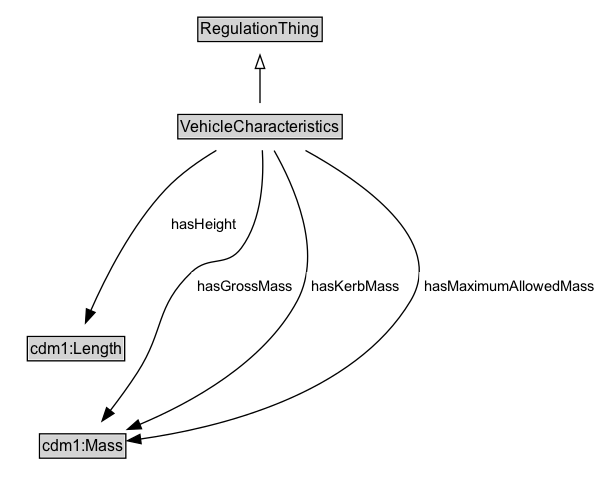

# VehicleCharacteristics

Characteristics of a vehicle.

## Diagram

=== "SVG (interactive)"

    <!-- Generated by graphviz version 14.1.3 (20260303.0454)
     -->
    <!-- Pages: 1 -->
    <svg width="454pt" height="373pt"
     viewBox="0.00 0.00 454.00 373.00" xmlns="http://www.w3.org/2000/svg" xmlns:xlink="http://www.w3.org/1999/xlink">
    <g id="graph0" class="graph" transform="scale(1 1) rotate(0) translate(4 368.5)">
    <polygon fill="white" stroke="none" points="-4,4 -4,-368.5 449.95,-368.5 449.95,4 -4,4"/>
    <g id="clust3" class="cluster">
    <title>cluster_associated</title>
    </g>
    <!-- RegulationThing -->
    <g id="node1" class="node">
    <title>RegulationThing</title>
    <g id="a_node1"><a xlink:href="../RegulationThing" xlink:title="&lt;TABLE&gt;">
    <polygon fill="lightgray" stroke="none" points="145.38,-338.38 145.38,-354.62 236.62,-354.62 236.62,-338.38 145.38,-338.38"/>
    <text xml:space="preserve" text-anchor="start" x="146.38" y="-342.38" font-family="Arial" font-size="12.00">RegulationThing</text>
    <polygon fill="none" stroke="black" points="144.38,-337.38 144.38,-355.62 237.62,-355.62 237.62,-337.38 144.38,-337.38"/>
    </a>
    </g>
    </g>
    <!-- VehicleCharacteristics -->
    <g id="node2" class="node">
    <title>VehicleCharacteristics</title>
    <g id="a_node2"><a xlink:href="../VehicleCharacteristics" xlink:title="&lt;TABLE&gt;">
    <polygon fill="lightgray" stroke="none" points="130.38,-265.38 130.38,-281.62 251.62,-281.62 251.62,-265.38 130.38,-265.38"/>
    <text xml:space="preserve" text-anchor="start" x="131.38" y="-269.38" font-family="Arial" font-size="12.00">VehicleCharacteristics</text>
    <polygon fill="none" stroke="black" points="129.38,-264.38 129.38,-282.62 252.62,-282.62 252.62,-264.38 129.38,-264.38"/>
    </a>
    </g>
    </g>
    <!-- VehicleCharacteristics&#45;&gt;RegulationThing -->
    <g id="edge1" class="edge">
    <title>VehicleCharacteristics&#45;&gt;RegulationThing</title>
    <path fill="none" stroke="black" d="M191,-291.21C191,-298.97 191,-308.42 191,-317.24"/>
    <polygon fill="none" stroke="black" points="187.5,-317.16 191,-327.16 194.5,-317.16 187.5,-317.16"/>
    </g>
    <!-- Invis -->
    <!-- VehicleCharacteristics&#45;&gt;Invis -->
    <!-- cdm1_Length -->
    <g id="node4" class="node">
    <title>cdm1_Length</title>
    <g id="a_node4"><a xlink:href="https://w3id.org/citydata/part1/v1/Length" xlink:title="&lt;TABLE&gt;">
    <polygon fill="lightgray" stroke="none" points="17.5,-98.88 17.5,-115.12 88.5,-115.12 88.5,-98.88 17.5,-98.88"/>
    <text xml:space="preserve" text-anchor="start" x="18.5" y="-102.88" font-family="Arial" font-size="12.00">cdm1:Length</text>
    <polygon fill="none" stroke="black" points="16.5,-97.88 16.5,-116.12 89.5,-116.12 89.5,-97.88 16.5,-97.88"/>
    </a>
    </g>
    </g>
    <!-- VehicleCharacteristics&#45;&gt;cdm1_Length -->
    <g id="edge6" class="edge">
    <title>VehicleCharacteristics&#45;&gt;cdm1_Length</title>
    <path fill="none" stroke="black" d="M158.28,-255.7C145.38,-248.01 131.1,-238.02 120.25,-226.5 94.83,-199.49 75.32,-161.12 64.02,-135.43"/>
    <polygon fill="black" stroke="black" points="67.28,-134.15 60.14,-126.33 60.84,-136.9 67.28,-134.15"/>
    <polygon fill="white" stroke="none" points="120.25,-189.75 120.25,-211.25 177,-211.25 177,-189.75 120.25,-189.75"/>
    <text xml:space="preserve" text-anchor="start" x="124.25" y="-196.75" font-family="Arial" font-size="11.00">hasHeight</text>
    </g>
    <!-- cdm1_Mass -->
    <g id="node5" class="node">
    <title>cdm1_Mass</title>
    <g id="a_node5"><a xlink:href="https://w3id.org/citydata/part1/v1/Mass" xlink:title="&lt;TABLE&gt;">
    <polygon fill="lightgray" stroke="none" points="26.62,-25.88 26.62,-42.12 89.38,-42.12 89.38,-25.88 26.62,-25.88"/>
    <text xml:space="preserve" text-anchor="start" x="27.62" y="-29.88" font-family="Arial" font-size="12.00">cdm1:Mass</text>
    <polygon fill="none" stroke="black" points="25.62,-24.88 25.62,-43.12 90.38,-43.12 90.38,-24.88 25.62,-24.88"/>
    </a>
    </g>
    </g>
    <!-- VehicleCharacteristics&#45;&gt;cdm1_Mass -->
    <g id="edge5" class="edge">
    <title>VehicleCharacteristics&#45;&gt;cdm1_Mass</title>
    <path fill="none" stroke="black" d="M192.76,-255.82C193.91,-236.32 192.91,-203.98 177,-182.5 166.06,-167.72 153.04,-177.21 139.75,-164.5 112.19,-138.15 119.65,-121.06 99,-89 92.82,-79.41 85.44,-69.34 78.66,-60.52"/>
    <polygon fill="black" stroke="black" points="81.48,-58.44 72.55,-52.73 75.97,-62.76 81.48,-58.44"/>
    <polygon fill="white" stroke="none" points="139.75,-143 139.75,-164.5 219,-164.5 219,-143 139.75,-143"/>
    <text xml:space="preserve" text-anchor="start" x="143.75" y="-150" font-family="Arial" font-size="11.00">hasGrossMass</text>
    </g>
    <!-- VehicleCharacteristics&#45;&gt;cdm1_Mass -->
    <g id="edge7" class="edge">
    <title>VehicleCharacteristics&#45;&gt;cdm1_Mass</title>
    <path fill="none" stroke="black" d="M201.6,-255.55C216.24,-229.81 238.7,-179.94 219,-143 194.17,-96.45 139.38,-66.41 100.63,-50.12"/>
    <polygon fill="black" stroke="black" points="102.15,-46.96 91.57,-46.45 99.53,-53.45 102.15,-46.96"/>
    <polygon fill="white" stroke="none" points="225.9,-143 225.9,-164.5 299.9,-164.5 299.9,-143 225.9,-143"/>
    <text xml:space="preserve" text-anchor="start" x="229.9" y="-150" font-family="Arial" font-size="11.00">hasKerbMass</text>
    </g>
    <!-- VehicleCharacteristics&#45;&gt;cdm1_Mass -->
    <g id="edge8" class="edge">
    <title>VehicleCharacteristics&#45;&gt;cdm1_Mass</title>
    <path fill="none" stroke="black" d="M225.12,-255.66C267.46,-232.36 331,-188.05 304,-143 261.4,-71.92 159.46,-47.48 101.05,-39.18"/>
    <polygon fill="black" stroke="black" points="101.85,-35.76 91.48,-37.93 100.94,-42.7 101.85,-35.76"/>
    <polygon fill="white" stroke="none" points="310.45,-143 310.45,-164.5 445.95,-164.5 445.95,-143 310.45,-143"/>
    <text xml:space="preserve" text-anchor="start" x="314.45" y="-150" font-family="Arial" font-size="11.00">hasMaximumAllowedMass</text>
    </g>
    <!-- Invis&#45;&gt;cdm1_Length -->
    <!-- cdm1_Length&#45;&gt;cdm1_Mass -->
    </g>
    </svg>

=== "PNG"

    

## Formalization for VehicleCharacteristics

| Property | Constraint |
|----------|------------|
| subClassOf | [RegulationThing](../properties/RegulationThing.md) |

## Other annotations

| Property | Value |
|----------|-------|
| [rdfs:seeAlso](https://w3id.org/citydata/imported/rdfs/seeAlso) | DATEX-II VehicleCharacteristics |
| [skos:editorialNote](https://w3id.org/citydata/imported/skos/editorialNote) | Some items are plural and some are not; it is not entirely clear why the multiplicity is shown as is. |

