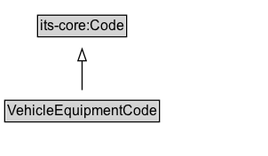

# VehicleEquipmentCode

A code that indicates the type of equipment that is carried by a vehicle.

EXAMPLE: trailer attached, snow tyres, snow chains on-board, snow chains in use, snow chains not in use, etc.

## Diagram

=== "SVG (interactive)"

    <!-- Generated by graphviz version 14.1.3 (20260303.0454)
     -->
    <!-- Pages: 1 -->
    <svg width="226pt" height="132pt"
     viewBox="0.00 0.00 226.00 132.00" xmlns="http://www.w3.org/2000/svg" xmlns:xlink="http://www.w3.org/1999/xlink">
    <g id="graph0" class="graph" transform="scale(1 1) rotate(0) translate(4 128)">
    <polygon fill="white" stroke="none" points="-4,4 -4,-128 222.38,-128 222.38,4 -4,4"/>
    <g id="clust3" class="cluster">
    <title>cluster_associated</title>
    </g>
    <!-- its&#45;core_Code -->
    <g id="node1" class="node">
    <title>its&#45;core_Code</title>
    <g id="a_node1"><a xlink:href="https://w3id.org/itsdata/core/v1/Code" xlink:title="&lt;TABLE&gt;">
    <polygon fill="lightgray" stroke="none" points="28.75,-97.88 28.75,-114.12 102,-114.12 102,-97.88 28.75,-97.88"/>
    <text xml:space="preserve" text-anchor="start" x="29.75" y="-101.88" font-family="Arial" font-size="12.00">its&#45;core:Code</text>
    <polygon fill="none" stroke="black" points="27.75,-96.88 27.75,-115.12 103,-115.12 103,-96.88 27.75,-96.88"/>
    </a>
    </g>
    </g>
    <!-- VehicleEquipmentCode -->
    <g id="node2" class="node">
    <title>VehicleEquipmentCode</title>
    <g id="a_node2"><a xlink:href="../VehicleEquipmentCode" xlink:title="&lt;TABLE&gt;">
    <polygon fill="lightgray" stroke="none" points="1,-25.88 1,-42.12 129.75,-42.12 129.75,-25.88 1,-25.88"/>
    <text xml:space="preserve" text-anchor="start" x="2" y="-29.88" font-family="Arial" font-size="12.00">VehicleEquipmentCode</text>
    <polygon fill="none" stroke="black" points="0,-24.88 0,-43.12 130.75,-43.12 130.75,-24.88 0,-24.88"/>
    </a>
    </g>
    </g>
    <!-- VehicleEquipmentCode&#45;&gt;its&#45;core_Code -->
    <g id="edge1" class="edge">
    <title>VehicleEquipmentCode&#45;&gt;its&#45;core_Code</title>
    <path fill="none" stroke="black" d="M65.38,-51.79C65.38,-59.25 65.38,-68.24 65.38,-76.69"/>
    <polygon fill="none" stroke="black" points="61.88,-76.54 65.38,-86.54 68.88,-76.54 61.88,-76.54"/>
    </g>
    <!-- Invis -->
    </g>
    </svg>

=== "PNG"

    

## Formalization for VehicleEquipmentCode

| Property | Constraint |
|----------|------------|
| subClassOf | [its-core:Code](its-core:Code.md) |

## Other annotations

| Property | Value |
|----------|-------|
| [rdfs:seeAlso](https://w3id.org/citydata/imported/rdfs/seeAlso) | DATEX-II VehicleEquipmentEnum |

